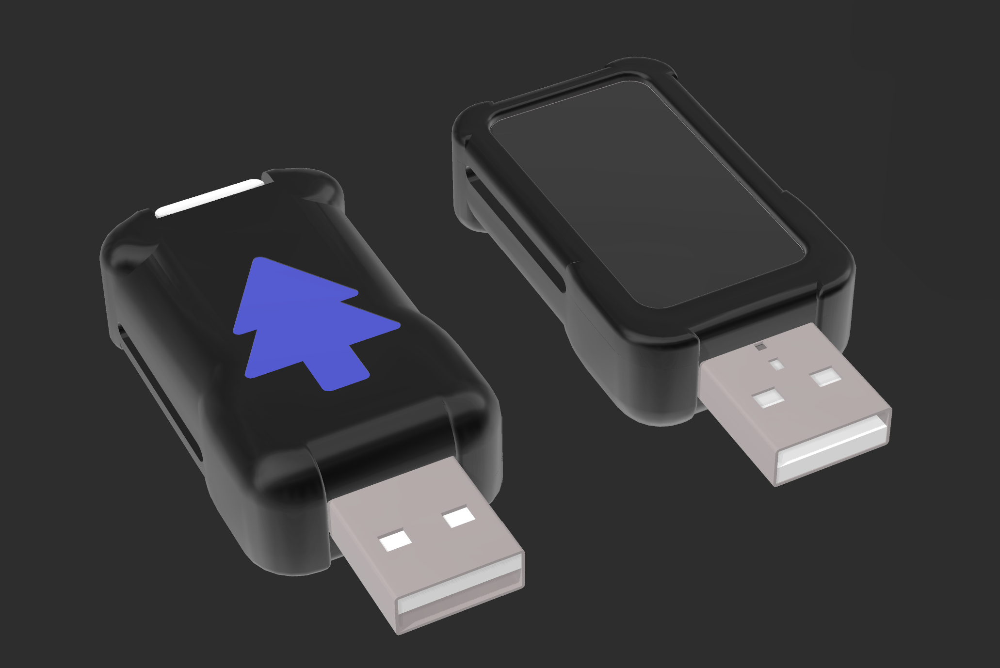

# <div align="center">Jcorp Nomad</div>

<div align="center">
  
</div>

<p align="center"><b>A portable, offline media server powered by the ESP32-S3 in a thumbdrive form factor.</b><br>
Stream movies, music, books, and shows anywhere — no internet required.</p>

<p align="center">
  
  
  
</p>

---

## What is Nomad

Jcorp Nomad is an open-source offline media server designed for travel, remote work, classrooms, camping, and more. It runs entirely on an ESP32-S3, creates a local Wi-Fi hotspot, and serves media through a browser interface. Multiple users can access separate media streams simultaneously, all without internet access.  

This project is compact, easy to modify, and includes optional 3D-printable hardware. Both firmware and web interface are fully open-source.

---

## Project Inspiration

Inspired by my experience running a Jellyfin server, I wanted a portable, low-cost solution for offline media streaming. Challenges with SBCs (Raspberry Pi, etc.) included high power usage, heat, and instability.  

Nomad focuses on delivering:

- Offline access  
- Wide device compatibility
- Simple frontend for media browsing and playback 
- Multiple user support
- High customization potential

The ESP32-S3 provides enough performance to handle these requirements efficiently, in a pocket-sized form factor.

---

## Stability & Features Update

Nomad is now **stable** on the `main` branch with several new features and improvements.  

**Notable Updates:**

- **EPUB support:** works, though formatting is rough.  
- **Audiobooks:** MP3 format with basic resume tracking; minor bugs may occur.  
- **CBZ support:** experimental; files may load slowly.  

---

## Key Improvements

1. **Faster & More Reliable Indexing**
   - Non-blocking, background indexing for large libraries.
   - Safe on power loss; partial indexes remain intact.
   - Auto-updates changes; frontend detects updates automatically.

2. **Resume Functionality**
   - Movies and Shows track playback progress.
   - Options for **Play from Start** or **Resume**.
   - Menu displays last three movies/shows; mobile shows most recent.

3. **Dark Mode**
   - Toggleable across all pages from the menu.
   - Minor visual bugs may exist depending on browser.

4. **Admin Page**
   - Full device control: shutdown, restart, flash mode, Wi-Fi, RGB LEDs, brightness, credentials, indexing, and file management.
   - Safe shutdown option for SD card health.
   - Real-time system console feedback.

5. **Stability Improvements**
   - Fixed frontend NDJSON sync issues.
   - Crash recovery on large indexes.
   - Dynamic LCD brightness adjustment.
   - Streaming stability enhancements.

6. **Improved Library Support**
   - Supports deeper folder structures for Shows and Music.
   - Flexible organization; media files can be nested at any level.

---

## Features

- Admin panel with full device controls  
- File browser: upload, rename, delete, download, inline editing  
- Global search on Menu page  
- Music player with playlists, shuffle, loop, downloads  
- Shows page with season folder support and specials  
- Books page: PDF, EPUB, and audiobook support  
- Gallery page: images and video playback  
- Files page for general-purpose sharing  
- Resume/play progress tracking for Movies and Shows  
- Captive portal for easy access  
- Persistent settings across reboots  
- Mobile-friendly web UI

---

## Hardware Requirements

- **Waveshare ESP32-S3 Dev Board (1.47" LCD version)**  
  [Amazon Link](https://amzn.to/4ktB6oT)  

- **FAT32 microSD card (16–64GB recommended)**  
  [Amazon Link](https://amzn.to/44tM1c4)  

- **SD-Card Extender (optional, 3DP case compatible)**  
  [Amazon Link](https://amzn.to/45IWIJz)  

- **USB power source**  
- **Optional:** 3D-printed enclosure (STL files included)

---

## Software Requirements

- Arduino IDE  
- Fat32Format or equivalent  
- SquareLine Studio (optional, for UI editing)

---

## Quick Start

1. Flash ESP32-S3 firmware from `/firmware/`.  
2. Format SD card as FAT32 and copy `/SD_Card_Template/` files.  
3. Place media in `/Movies`, `/Shows`, `/Books`, `/Music`, `/Gallery`, `/Files`.  
4. Insert SD card and power device via USB.  
5. Connect to Wi-Fi `Jcorp_Nomad` with password: `password`.  
6. Open the browser interface.  
7. Click the gear icon → Library Index → **Full Scan Now**.  
8. Monitor Admin Console for progress; scan may take minutes.  
9. Return to Menu page and enjoy your media!

---
```
## Folder Structure

/Movies
    Interstellar.mp4
    Interstellar.jpg

/Shows
    /The Office
        S01E01 - Pilot.mp4
        S01E02 - Diversity Day.mp4
    The Office.jpg
    
    /Gravity Falls
        /Season 1
            S1E1 - Tourist Trapped.mp4
            S1E2 - The Legend of the Gobblewonker.mp4
        /Season 2
            S2E1 - Scary-oke.mp4
            S2E2 - Into the Bunker.mp4
        Alex Hirsch Interview.mp4
    Gravity Falls.jpg

/Books
    The Martian.pdf
    The Martian.jpg

/Music
    track01.mp3
    /Artist1
        track01.mp3
        /Album1
            track02.mp3
    /PersonName
        /Playlist1
            track01.mp3
        /Playlist2
            track02.mp3

/Gallery
    image01.jpg
    video01.mp4

/Files
    document.pdf
    example.txt

index.html
appleindex.html
menu.html
movies.html
shows.html
books.html
music.html
gallery.html
files.html
Logo.png
favicon.ico
```
---

## Supported Formats

- **Video:** `.mp4, .mov, .mkv, .webm`  
- **Audio:** `.mp3, .flac, .wav`  
- **Books:** `.pdf, .epub, .mp3`  
- **Images:** `.jpg`

---

## Future Plans

- Offline maps with GPS support  
- Retro game emulation  
- Chat page / message board  
- Collaborative whiteboard / sketch page  
- Full CBZ comic support

---

## License

[CC BY-NC-SA 4.0](https://creativecommons.org/licenses/by-nc-sa/4.0/) — free to remix and share for non-commercial use with attribution.

---

## Credits

Developed by **Jackson Studner (Jcorp Tech)**.  
Inspired by open-source offline media projects. Contributions via PRs welcome.
